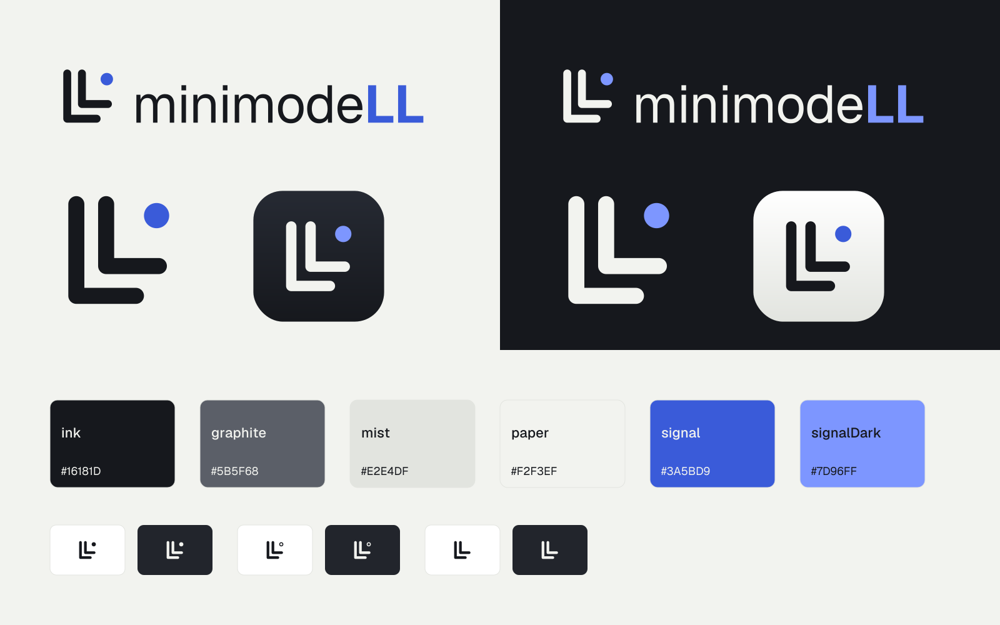

<p align="center">
  <a href="https://github.com/jsbonsai/minimodeLL">
    <picture>
      <source media="(prefers-color-scheme: dark)" srcset="design-assets/minimodeLL-brand/logo/svg/lockup-horizontal-reversed.svg">
      <source media="(prefers-color-scheme: light)" srcset="design-assets/minimodeLL-brand/logo/svg/lockup-horizontal-color.svg">
      
    </picture>
  </a>
</p>

<p align="center"><strong>Local models. MCP tools. Managed by IT.</strong><br>
A native macOS menu bar assistant for small workplace tasks, built so the people who run Macs can govern it.</p>

<p align="center">
  <a href="https://github.com/jsbonsai/minimodeLL/actions/workflows/ci.yml"></a>
  <a href="https://github.com/jsbonsai/minimodeLL/actions/workflows/pages.yml"></a>
  <a href="LICENSE"></a>
  
  
  
</p>

---

minimodeLL runs approved local models on the employee's own Mac, calls allowlisted MCP tools only after the person approves the actual arguments, and records every step as content-free audit metadata. What makes it different from a consumer local-model app is that IT can govern it: a complete policy (which providers, models, MCP servers, and tools, and which of those need a human first) can be forced through Jamf or Iru (formerly Kandji) as a managed preference, user settings can never extend a managed allowlist, invalid policy fails closed, and there is no silent cloud fallback. Explicit LiteLLM gateway models are supported when a data policy permits them, labeled in the UI before submission. The same app is fully usable without any MDM.

**Status: developer preview.** The app and policy engine build on Apple Silicon. Unit tests use deterministic fake providers and tools. Live model quality, enterprise OAuth interoperability, notarization, and MDM behavior still require validation before production use.

**Website and docs:** the landing page and rendered documentation are published from this repository by GitHub Actions (see [`site/`](site/README.md)); the [documentation map](docs/README.md) links every source document.

## Why

- **Policy is enforced in code, not in a prompt.** Model, server, and tool allowlists plus per-tool approval rules live in a typed, validated policy that a system prompt or MCP annotation cannot override.
- **One task, one bounded run.** Fresh context per task, one tool call per model response, and hard limits on input, context, output, steps, result size, and wall time. No background work; writes are never retried automatically.
- **Local by default, cloud only by choice.** Local providers must be literal loopback HTTP; remote providers must be HTTPS; inference redirects are refused. A LiteLLM gateway is an explicit, labeled selection, never a fallback.
- **Governable at fleet scale.** The same JSON schema validates a user's `config.json` and an MDM-forced `PolicyJSON`; the repo generates the configuration profile and ships an offline diagnostics CLI for MDM scripts.
- **Audit without content.** JSONL and OSLog carry timestamps, run IDs, event categories, and model/server/tool IDs. Prompts, responses, tool arguments, results, tokens, and raw remote error bodies are never logged.

## What works today

- SwiftUI task window, menu bar entry, settings, cancellation, and explicit tool approvals.
- OpenAI-compatible local inference and LiteLLM gateway configuration. No automatic cloud fallback.
- Official MCP Swift SDK, pinned at 0.12.1: Streamable HTTP, tool discovery, native browser OAuth with PKCE, and Keychain token storage.
- Approved model stubs and explicit per-server tool allowlists; one active task and one tool call per step.
- Request, output, context, tool-step, tool-result, and time budgets. Unknown tools and invalid arguments are blocked.
- JSONL audit metadata and OSLog events with bounded local retention; no prompt, response, argument, or credential logging.
- Optional forced MDM policy, profile generator, hardware inventory script, and a diagnostics executable.
- Sandboxed `.app` packaging plus DMG and PKG build scripts.

## Build and open

Requires an Apple Silicon Mac, macOS 14+, Xcode 16.4 / Swift 6.1 or newer, and Git. No Python or Node runtime is required by the app. Packaging/profile tooling uses the Python shipped with Xcode command line tools.

```sh
swift test
scripts/package-app.sh
open build/minimodeLL.app
```

The development app is ad-hoc signed and sandboxed. Gatekeeper distribution requires Developer ID signing and notarization. `swift run minimodell` is useful for UI development but does **not** exercise the packaged sandbox.

### Preview the UI without a model

Run `python3 scripts/mock-inference.py`, then submit a short request in the app. This explicit fixture returns a labeled canned response and makes no outbound requests. Stop it with Ctrl-C before starting a real inference server on the same port.

### Connect inference

**Bundled runtime and a verified model (developer preview).** Run `scripts/fetch-runtime.sh` and then `REQUIRE_RUNTIME=1 scripts/package-app.sh`. The packaged app then carries a pinned, hash-verified `llama-server` (ADR 0008). Use `Config/bundled-runtime.example.json` as your configuration, which references the built-in artifact `qwen3-4b-instruct-2507-q4_k_m` (Qwen3-4B-Instruct-2507 Q4_K_M, Apache-2.0, 2.5 GB). Open Settings → Models and choose **Download**, or **Import** a copy you already have. The app checks the file's size and SHA-256 before it can be used (ADR 0009). The app downloads nothing until you ask. One M1 Pro/32 GB run measured about 1 s to load and about 41 tokens/s; see `docs/validation-results.md`. That is a single-machine measurement, not a support claim.

**External server.** You can also connect to an `llama-server` you start yourself. Start a tool-capable GGUF with a tested template and bounded context, for example:

```sh
llama-server --model /path/to/approved.gguf --alias local-model \
  --host 127.0.0.1 --port 9931 --ctx-size 8192 --parallel 1 --jinja
```

This example exposes inference to other local processes. For authenticated local inference, use llama-server's API-key configuration, add a `credentialAccount` to the local provider, and save the matching token in the app's Credentials tab. The bundled runtime above does this for you: a random loopback port and a per-launch key.

The starter configuration expects the alias `local-model`. Open Settings → Configuration to edit it. A model stub is an approved provider model ID plus its context and memory requirements; it is not a downloaded model or proof of model quality.

For LiteLLM, add an HTTPS provider and a model whose `model` value matches the gateway alias. Save the gateway token in Credentials under the configured `credentialAccount`. The UI labels cloud inference before submission. Tool results are sent to the selected provider, so select cloud models only when your data policy permits it.

### Connect tools

Start from `Config/enterprise.example.json`. Its `.example.com` URLs are placeholders and its tool allowlists are empty intentionally. Set real HTTPS Streamable HTTP endpoints and add exact tool names, for example:

```json
"tools": [{"name": "your_actual_search_tool", "requiresConfirmation": true}]
```

Set confirmation to false only for operations you have reviewed as safe to run automatically. Tool annotations from servers do not grant approval. Tools with unsupported JSON Schema constraints fail closed; see `docs/architecture.md` for the supported subset. Keep the selected tool set small so schemas fit the context budget.

Register a native public OAuth client with redirect URI `org.minimodell.agent://oauth-callback`, or configure an explicit bearer-token account. Do not embed a web application's OAuth client secret. Existing LibreChat OAuth registrations may need a separate native client registration. The app starts browser sign-in on the first authenticated task. Legacy HTTP+SSE endpoints, custom provider OAuth extensions, and enterprise IdP flows require interoperability work.

## Policy and deployment

The app resolves one effective policy in this order:

1. Forced `PolicyJSON` in the `org.minimodell.agent` preference domain, when delivered by MDM.
2. User `config.json` in the app's Application Support directory.
3. Bundled starter defaults.

Invalid forced policy blocks requests. Managed policy is a complete replacement; user settings cannot extend the managed model or tool allowlists. Policy is captured at task start; emergency revocation of an action already in flight must happen at the service or identity provider.

```sh
swift run minimodell-diagnostics --config Config/enterprise.example.json
scripts/make-profile.py Config/enterprise.example.json build/minimodell.mobileconfig
```

Upload the generated configuration profile to Jamf and scope it independently of the application PKG. This project has no dependency on the Jamf API. See [deployment](docs/deployment.md), the [Jamf sandbox test plan](docs/jamf-test-plan.md), the [Iru (formerly Kandji) best-effort guide](docs/kandji.md), and [validation](docs/validation.md). Iru has no tenant validation yet; Jamf validation is planned with a scoped sandbox.

## Branding

Edit `Sources/LocalAgentCore/Resources/Branding.json` and rebuild to change the display name and version. All user-facing app names and package names use it. Keep `bundleIdentifier` stable once deployed: it anchors policy, OAuth callbacks, storage, and Keychain records. A distribution fork should establish its identifier before enrolling users.

The Twin L mark, lockups, app and menu bar icons, web assets, fonts, and color tokens live in [`design-assets/minimodeLL-brand/`](design-assets/minimodeLL-brand/README.md); the app's curated runtime subset is described in [docs/branding.md](docs/branding.md).

<p align="center">
  
</p>

## Continuing development

Start with [AGENTS.md](AGENTS.md) and the [current handoff](docs/handoff.md). The [documentation map](docs/README.md) links the detailed implementation state, configuration reference, architecture decisions, code map, ordered backlog and session records. Material changes include documentation updates so another contributor can resume without the original chat.

## Architecture and project status

`LocalAgentCore` contains configuration, policy, inference, MCP, credentials, audit, and task orchestration. `MinimodeLL` contains the macOS UI and browser authentication. `AgentDiagnostics` shares the configuration validator. Packaging and MDM integrations live outside the application core.

See [architecture](docs/architecture.md), [security](SECURITY.md), [roadmap](docs/roadmap.md), and [contributing](CONTRIBUTING.md). The original PRDs are historical inputs; the current architecture and implementation take precedence where they differ.

## License

MIT. Dependency and model licenses remain separate. No model weights or prebuilt app binaries are published in this preview; a locally packaged app embeds the MIT-licensed llama.cpp runtime together with its license. Geist and Geist Mono are distributed under the SIL Open Font License; see `design-assets/minimodeLL-brand/fonts/OFL.txt`.
