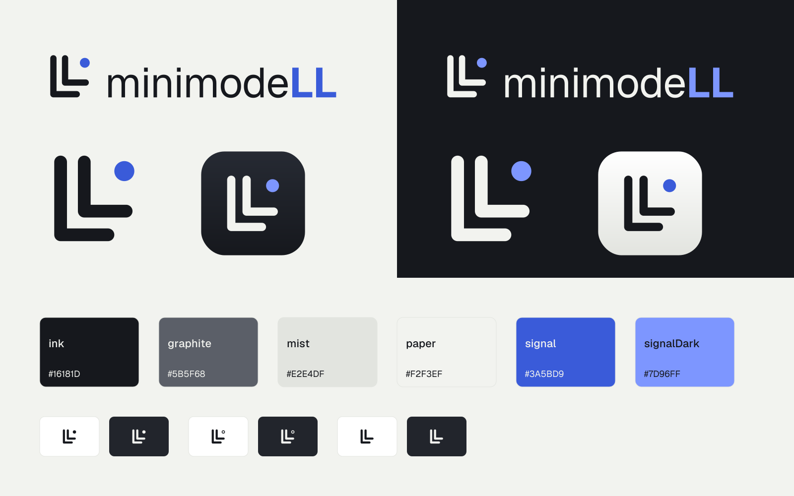

# minimodeLL brand kit

The mark is **Twin L**: two nested L strokes (the "LL" in the name) with a status dot. The dot is the only part of the mark that changes. It shows whether the local model server is running, idle or off, so the logo and the menu bar icon are the same object.



## Where things are

| Folder | What's in it | Use it for |
|---|---|---|
| `logo/svg`, `logo/png` | Mark, horizontal lockup, stacked lockup and wordmark in four colourways | Docs, README headers, slides, website |
| `app-icon/` | `AppIcon.icns`, 1024 px masters (dark and light), layered SVGs for Icon Composer | Build settings, App Store, DMG background |
| `xcode/Assets.xcassets` | App icon set, menu bar template images (vector PDF), `BrandMark`, and colour sets with dark variants | Drag the whole catalog into the Xcode project |
| `menubar/` | Template icons as SVG and PNG at @1x, @2x and @3x | Non-Xcode builds (Electron, Tauri, etc.) |
| `swift/` | `MinimodeMark.swift` (native SwiftUI mark with states) and `BrandColors.swift` | In-app logo, About window, onboarding |
| `web/` | Favicons (SVG adapts to dark mode), ICO, touch and PWA icons, manifest, OG images, `head-snippet.html` | Marketing site and docs site |
| `social/` | Avatars (400 px) and a 1200×630 banner | GitHub org, Slack app, LinkedIn |
| `tokens/` | `tokens.json` (W3C format), `brand.css`, `tailwind.brand.js` | Admin UI, docs theme, website |
| `fonts/` | Geist and Geist Mono (SIL Open Font License, `OFL.txt` included) | Everywhere text appears |

Every logo file has its text converted to outlines, so the logos render correctly without Geist installed.

## Colourways

- `color` for light backgrounds: ink mark, Signal dot and "LL".
- `reversed` for dark backgrounds: paper mark, Signal Dark dot and "LL".
- `black` and `white` for one-colour use, such as print, embossing, partner logo walls, or any place where colour isn't allowed.

## Colour

| Token | Hex | Role |
|---|---|---|
| ink | `#16181D` | Text and the mark on light backgrounds; dark-mode surface |
| graphite | `#5B5F68` | Secondary text |
| mist | `#E2E4DF` | Borders and dividers |
| paper | `#F2F3EF` | Light surface; the mark on dark backgrounds |
| signal | `#3A5BD9` | Accent on light surfaces |
| signalDark | `#7D96FF` | Accent on dark surfaces |
| running, warning, blocked | `#1F8A5B`, `#B7791F`, `#C23B3B` | Server, MCP and model status in the UI |

These contrast ratios meet WCAG AA:

- Ink on paper: 15.9:1
- Graphite on paper: 5.7:1
- Signal on paper: 5.1:1
- Signal Dark on ink: 6.5:1

Keep Signal for interactive elements and the dot. It shouldn't be used as a large background fill.

## Using the mark

- **Clear space:** leave at least the diameter of the dot on every side.
- **Minimum size:** 16 px for the mark alone, 96 px wide for the horizontal lockup, and 64 px wide for the stacked lockup.
- **Wordmark:** "minimode" is set in Geist Regular and "LL" in Geist Bold. Always write the name as **minimodeLL**, never "MinimodeLL" or "minimodell".
- **Don'ts:** don't recolour the strokes with Signal, don't stretch or rotate the mark, don't add shadows or outlines, and don't move the dot.

## Menu bar states

| Asset | Meaning |
|---|---|
| `MenuBarIconTemplate` | Solid dot: the server is running |
| `MenuBarIconIdleTemplate` | Ring dot: the server is up with no model loaded, or it's paused |
| `MenuBarIconOffTemplate` | No dot: the server is stopped or unreachable |

These are template images: pure black on a transparent background, in an 18 pt box. macOS tints them automatically for light mode, dark mode and the highlighted state, so don't colour them.

```swift
statusItem.button?.image = NSImage(named: "MenuBarIconTemplate")
// or
MenuBarExtra("minimodeLL", image: "MenuBarIconTemplate") { RootView() }
```

To draw the mark in-app, use `MinimodeMark(state: .active)`. It reads `BrandInk` and `AccentColor` from the asset catalog, so it adapts to light and dark mode on its own.

## App icon

`AppIcon-dark` is the primary icon. `AppIcon-light` is an alternate, for example a light-mode variant or a beta build.

For macOS 26 icons made in Icon Composer, import the three files in `icon-composer-layers/` as separate layers: `background`, `glyph` and `dot`. Keeping them separate lets the system apply its glass and tint treatments per layer.

## Web

Copy the `web/` folder to your site root and paste `head-snippet.html` into the page's `<head>`. `og-image.png` is the default share image; `og-image-dark.png` is there if you'd rather use a dark one.
