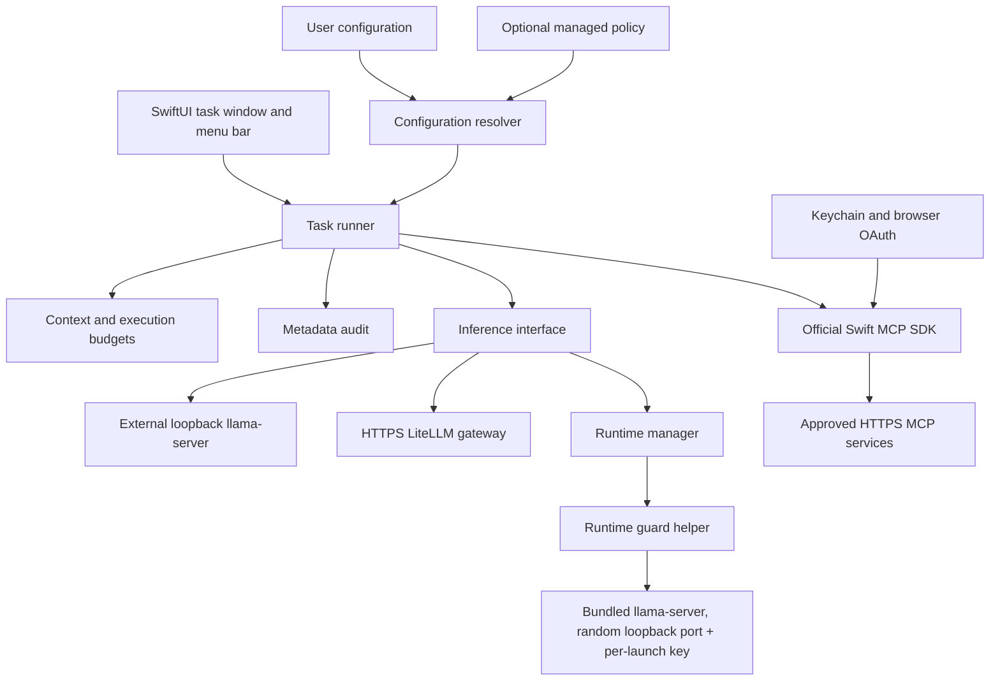
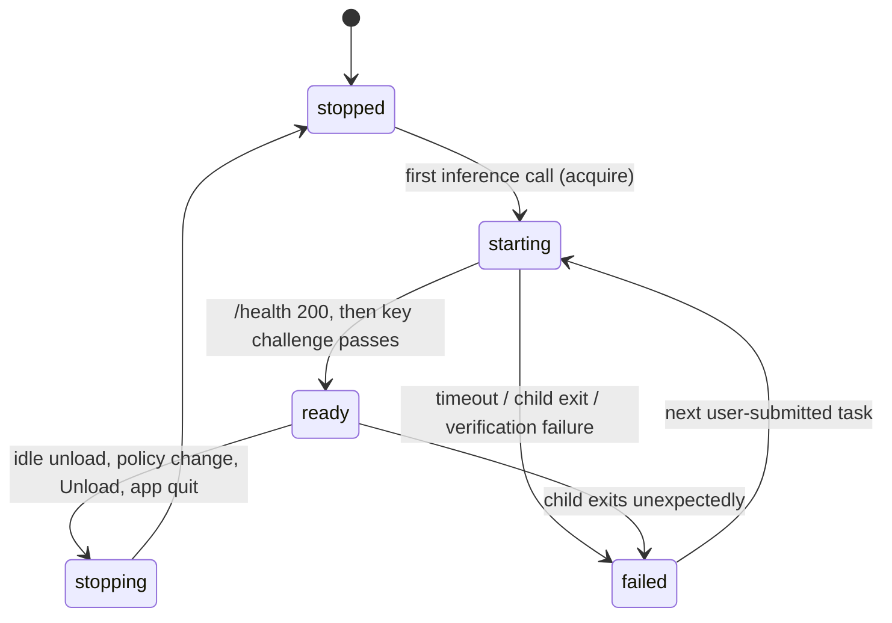
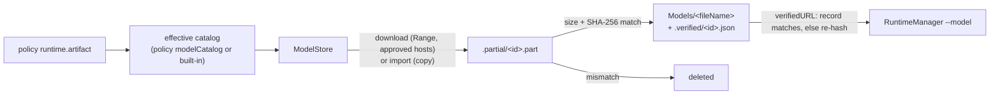

# Architecture decisions

## Product boundary

One small task starts with a fresh model context. A task may invoke a few approved tools and return a concise answer. There is no document ingestion, conversation history, autonomous background work, shell execution, MCP sampling, or silent cloud fallback in this preview.

## Components

A fresh app avoids inheriting Llama-macOS's arbitrary model installation, network exposure settings, and local overrides. llama.cpp is the runtime. The runtime revision is now pinned (`packaging/runtime.lock.json`, ADR 0008); model artifacts now pin hash, size, quantization, template notes, runtime tag and approved context together (ADR 0009). Qualification by benchmark is still separate (WORK-005).

## Bundled runtime lifecycle (ADR 0008)

A `managed` provider makes the app own a bundled `llama-server`:

- `RuntimeManager` (actor, `Runtime.swift`) chooses a free 127.0.0.1 port, creates a 256-bit key, and launches `Contents/Helpers/minimodell-runtime-guard <llama-server> --model … --host 127.0.0.1 --port N --alias … --ctx-size … --parallel … --no-webui --offline --no-slots --log-disable` with an explicit environment containing `LLAMA_API_KEY`. Child output is discarded.
- Readiness: poll `/health` (public) until the configured timeout, then require the child alive, 401 for no key and for a random decoy key, 200 for the real key with the expected alias and sufficient `n_ctx`. The challenge stands in for socket-ownership checks, which App Sandbox denies.
- `ManagedInferenceClient` acquires a lease per inference call and releases it afterwards; idle unload only runs with zero leases. A child exit maps to `failed(reason)` and the task error shows that reason. No background restart, no cloud fallback.
- The guard forwards termination signals and stops the server if the app disappears, so a crashed or force-killed app does not leave a model resident in memory.
- `minimodell --runtime-smoke-test [--tool] [--show-reply] [--hold N]` runs the same path with fixed synthetic prompts inside the packaged app's sandbox. It prints a JSON report: timings, token counts and throughput, and state. Reply text appears only with `--show-reply`, and every prompt is synthetic. `--tool` adds a synthetic tool round trip through `TaskRunner` with an in-process fixture tool (`SyntheticOrderTool`); no MCP server or account is involved.
- The launch arguments include `--jinja`. It is the b11140 default, but tool-call parsing depends on it.

## Verified model artifacts (ADR 0009)

- `ModelCatalog.swift` defines `ModelArtifact` (identity, pinned source, size, SHA-256, quantization, license, template notes, runtime tags, minimum memory, approved context) and the effective catalog. A configuration's `modelCatalog` replaces built-in fields. A forced managed policy replaces the whole configuration, so users cannot extend it. An invalid catalog fails validation, with no fallback.
- `ModelStore` (actor, `ModelStore.swift`) owns the `Models` folder. It downloads through the `ArtifactTransport` seam: `URLSessionArtifactTransport` streams straight to disk, resumes with Range after network interruptions, follows redirects only to HTTPS approved hosts, and caps the body at `sizeBytes`. It checks free disk space, verifies size and hash **before** an atomic `rename(2)`, and supports cancel (removes the partial file), delete, and import (hashes the copied file). Statuses: `notInstalled`, `unverified`, `downloading(received,total)`, `verifying`, `ready`, `failed(reason)`.
- `RuntimeManager` launches an artifact only when the policy names it, the bundled runtime tag is in its `runtimeTags`, and `ModelStore.verifiedURL` succeeds. Otherwise the task fails with a clear reason and nothing is launched.
- UI: Settings → Models lists the effective catalog with status and Download / Cancel / Delete / Import. It is deliberately plain; a redesign is backlog. `minimodell --model-download [id]` runs the same store path headlessly inside the sandbox.

## Provider and catalog design

A provider describes an endpoint, local/cloud kind, and optional Keychain credential account. A model stub selects a provider alias and sets minimum physical memory and context length. Local endpoints must be literal loopback HTTP; remote endpoints must use HTTPS. URLs cannot contain credentials, query parameters, or fragments. Inference redirects are rejected.

Physical memory is an eligibility check, not a prediction of free memory. Model size, KV cache, runtime buffers, other apps, and memory pressure all matter. The 16/24/32/64 GB fleet provides measurement targets; this preview does not automatically pick larger models on larger Macs.

## Policy

MDM is an adapter at the configuration boundary, not a required service. Jamf and Kandji share the same artifacts; Jamf is the initial live validation target and Kandji remains best-effort until tenant testing is possible. Both managed and user policy use the same versioned Codable schema and validation. Forced managed preferences replace user configuration. There are no secrets in policy. The app re-resolves policy for every task and uses one immutable snapshot during the run.

An application-level catalog controls requests from this application. It does not prevent an administrator or user with other software from using a different model outside this app.

## Execution limits

Initial defaults: 2,048 UTF-8 input bytes, 768 maximum output tokens per model response, 4 tool calls, 2,048 UTF-8 bytes per tool result, and 120 seconds per task. These are starting values, not benchmark-derived promises.

Before every inference call, encoded messages plus selected tool schemas, output reservation, and framing allowance must fit a conservative context estimate based on UTF-8 bytes. Exact tokenization of the complete rendered template is a production gate. A byte estimate intentionally rejects some requests that would fit. Server-side context and output limits remain necessary.

Only one tool call per response is accepted. Tool IDs, names, JSON arguments, configured approval rules, and supported schema constraints are checked before execution. No automatic retries for writes. Cancellation is best effort: a remote action already accepted by a service may complete.

Supported schema constraints: object/array/string/integer/number/boolean/null types, properties, required, additionalProperties, items, enum, minimum/maximum, minLength/maxLength, minItems/maxItems. Descriptive metadata is accepted. Unsupported keywords (including `$ref`, `oneOf`, formats and patterns) reject the tool. Production interoperability should add a maintained full JSON Schema validator with conformance tests.

## OAuth and transport

The SDK handles protocol negotiation, discovery, PKCE, and token refresh. The UI supplies ASWebAuthenticationSession, retaining it until callback or cancellation. The app supplies Keychain persistence. Public native clients never receive a bundled shared secret. Streamable HTTP is supported; legacy HTTP+SSE requires a separate adapter if actual company servers need it.

## Audit

JSONL entries contain timestamp, run ID, event category, model ID and optional configured server/tool ID. OSLog records only event category and run ID. Active and previous JSONL files are bounded to roughly 2 MiB total. Failure to write an audit event blocks further task progress. Files are private to the app's user, but can still be modified by that user or an administrator. Central collection and retention are deployment concerns; no content is uploaded automatically.

## Packaging and sandbox

The packaged app enables App Sandbox, outbound network access, loopback listening (`network.server`, needed by the inheriting runtime helper), and Hardened Runtime. Development execution through SwiftPM is not sandboxed and has no bundled runtime. Diagnostics is a separate read-only CLI so an MDM policy can invoke it without launching a user's UI.

When `scripts/fetch-runtime.sh` has run, `scripts/package-app.sh` embeds `llama-server` and the guard in `Contents/Helpers/`, the llama.cpp dylibs in `Contents/Frameworks/` (helper rpath rewritten to `@executable_path/../Frameworks`), the upstream MIT license, and the lock file in `Contents/Resources/Runtime/`. Nested code is signed inside-out; both helpers carry only `app-sandbox` + `inherit`. Ad-hoc builds sign `llama-server` without hardened runtime because library validation rejects ad-hoc dylibs (different Team IDs); a real Developer ID keeps it on (unvalidated). Sandbox inheritance, loopback-only binding, authentication, file-access confinement and orphan cleanup were verified live on the packaged app (see validation results). Developer ID/notarization, memory-pressure controls, hung-inference cancellation and a qualified model remain release gates.
