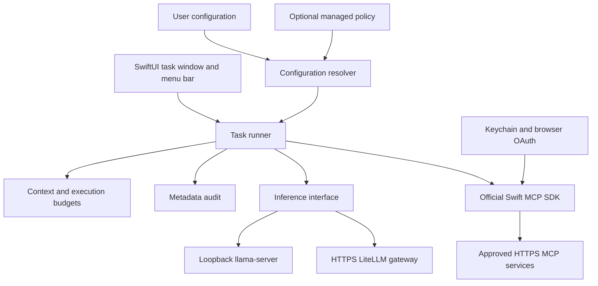

# Architecture decisions

## Product boundary

One small task starts with a fresh model context. A task may invoke a few approved tools and return a concise answer. There is no document ingestion, conversation history, autonomous background work, shell execution, MCP sampling, or silent cloud fallback in this preview.

## Components

A fresh app avoids inheriting Llama-macOS's arbitrary model installation, network exposure settings, and local overrides. llama.cpp remains the planned runtime. A supported deployment will pin the runtime revision, model hash, quantization, template, and context limit together.

## Provider and catalog design

A provider describes an endpoint, local/cloud kind, and optional Keychain credential account. A model stub selects a provider alias and sets minimum physical memory and context length. Local endpoints must be literal loopback HTTP; remote endpoints must use HTTPS. URLs cannot contain credentials, query parameters, or fragments. Inference redirects are rejected.

Physical memory is an eligibility check, not a prediction of free memory. Model size, KV cache, runtime buffers, other apps, and memory pressure all matter. The 16/24/32/64 GB fleet provides measurement targets; this preview does not automatically pick larger models on larger Macs.

## Policy

MDM is an adapter at the configuration boundary, not a required service. Jamf and Kandji share the same artifacts; Jamf is the initial live validation target and Kandji remains best-effort until tenant testing is possible. Both managed and user policy use the same versioned Codable schema and validation. Forced managed preferences replace user configuration. There are no secrets in policy. The app re-resolves policy for every task and uses one immutable snapshot during the run.

An application-level catalog controls requests from this application. It does not prevent an administrator or user with other software from using a different model outside this app.

## Execution limits

Initial defaults: 2,048 UTF-8 input bytes, 768 maximum output tokens per model response, 4 tool calls, 2,048 UTF-8 bytes per tool result, and 120 seconds per task. These are starting values, not benchmark-derived promises.

Before every inference call, encoded messages plus selected tool schemas, output reservation, and framing allowance must fit a conservative context estimate based on UTF-8 bytes. Exact tokenization of the complete rendered template is a production gate. A byte estimate intentionally rejects some requests that would fit. Server-side context and output limits remain necessary.

Only one tool call per response is accepted. Tool IDs, names, JSON arguments, configured approval rules, and supported schema constraints are checked before execution. No automatic retries for writes. Cancellation is best effort: a remote action already accepted by a service may complete.

Supported schema constraints: object/array/string/integer/number/boolean/null types, properties, required, additionalProperties, items, enum, minimum/maximum, minLength/maxLength, minItems/maxItems. Descriptive metadata is accepted. Unsupported keywords (including `$ref`, `oneOf`, formats and patterns) reject the tool. Production interoperability should add a maintained full JSON Schema validator with conformance tests.

## OAuth and transport

The SDK handles protocol negotiation, discovery, PKCE, and token refresh. The UI supplies ASWebAuthenticationSession, retaining it until callback or cancellation. The app supplies Keychain persistence. Public native clients never receive a bundled shared secret. Streamable HTTP is supported; legacy HTTP+SSE requires a separate adapter if actual company servers need it.

## Audit

JSONL entries contain timestamp, run ID, event category, model ID and optional configured server/tool ID. OSLog records only event category and run ID. Active and previous JSONL files are bounded to roughly 2 MiB total. Failure to write an audit event blocks further task progress. Files are private to the app's user, but can still be modified by that user or an administrator. Central collection and retention are deployment concerns; no content is uploaded automatically.

## Packaging and sandbox

The packaged app enables App Sandbox, outbound network access, and Hardened Runtime. Development execution through SwiftPM is not sandboxed. Diagnostics is a separate read-only CLI so an MDM policy can invoke it without launching a user's UI. The current app talks to an external inference server; runtime sandbox inheritance, signed helper embedding, model file access, local authentication, lifecycle and memory-pressure controls are release gates.
